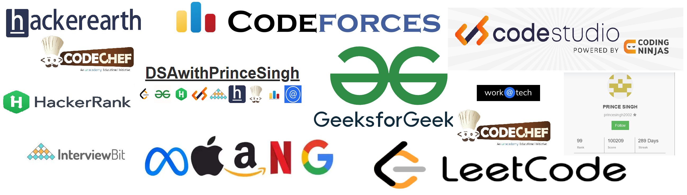

<h1 align="center">Hi  I'm <b>Prince Singh</b></h1>
<h2 align="center"><b>I'm a Passionate for Coding and Developement from India 🏳️‍🌈</b></h2>
<h4 align="center"><b>Problem Solving Enthusiast || 3.5⭐ LEETCODE || 6⭐ Problem Solving || Institute 1st🥇 Rank GFG || Global 99th🥇 Rank InterviewBit || Expert on CodeStudio || Amateur HackerEarth || 1474+ Rating 2⭐ CodeChef || Newbie CodeForces || 1500+ Problems Solved on DSA
</b></h4>

<!--  -->

## 🙋‍♂️ About Me

- 📔 Live [**MyResume**](https://princesinghhub.github.io/MYWebResume/) 
- 👨‍💻 Check My! [**CodingProfile**](https://princesinghhub.github.io/MyCodingProfiles/)
- 🔭 I’m currently Studing in **3rd Year**
- 📘 I’m currently learning **MERN Stack Developement**
- 👯 I’m looking to collaborate on **OpenSource Projects**
- ⚡ For Fun **I play games and interested in Rosting,Mems**
- 📫 How to reach me **thisisprincesingh@gmail.com**
- 🔗 Connect Me on [**Linkedin**](https://www.linkedin.com/in/prince-singh-314a65187/)

## ❤️ DSA ZONE
✅ I have solved almost 1500+ DSA Problems on, Different-Different Coding Platforms.  
✅ Problem Solving 6⭐ in Problem Solving  
✅ LeetCode 700+ Problem Solved || 3.5⭐ Star || Max Rating 1400+ || Under 20k Rank  
✅ GeeksForGeeks 1000+ Problem Solved || 2700+ Score || 1st Rank in Institue || 328 Global Rank  
✅ CodeStudio 800+ Problem Solved || 40325+ Score || 1st Rank in Institue || Expert on CodeStudio  
✅ InterviewBit 480+ Problem Solved || 103918+ Score || Level 7 || 58 Global Rank  
✅ HackerRank 200+ Problem Solved || 5⭐ in Python || 5⭐ in Java || 5⭐in Days of Code || 5⭐ in JS || 5⭐ in Statistics || 2⭐ in SQL  
✅ HackerEarth 30+ Problem Solved || 630+ Score || Amateur on HackerEarth || 5⭐ in Python || 3⭐ O(n)  
✅ CodeChef 2⭐ Div 3 || Max Rating 1530+ || Global Rank 37470 || 80+ Problem Solved  
✅ CodeForces 364 Max Rating (Newbie) || 40 Problem Solved  
✅ work@Tech 1510 Score || 999 Rank || 40 Problem Solved  

## 🚀 Languages and Tools:

 
    
    
     
     
     
    
    
     
    
    
    
     
    
     
    
      
      
      
     
    
    
    
    

    

## 📊 My Github Stats

    

  
   
  <b>Note:</b> Top languages is only a metric of the languages my public code consists of and doesn't reflect experience or skill level.

 
 

 
 

   

## Connect with me:

## ❤ Views and Followers

