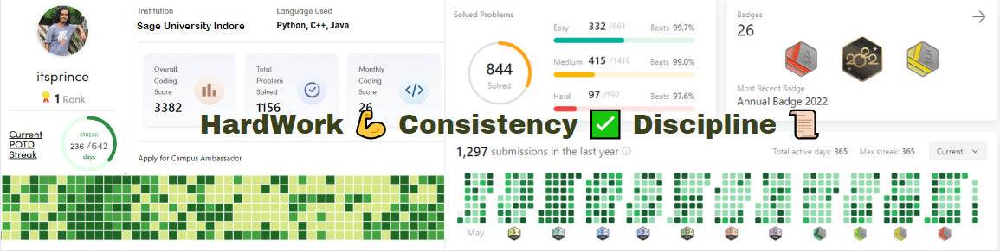
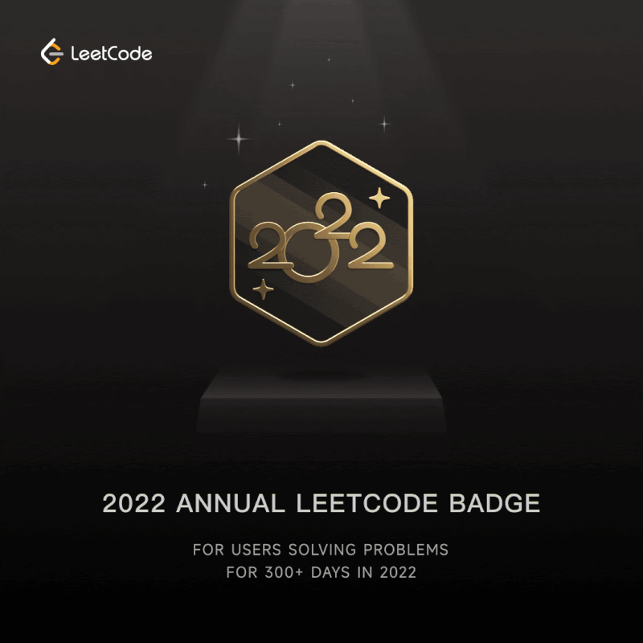
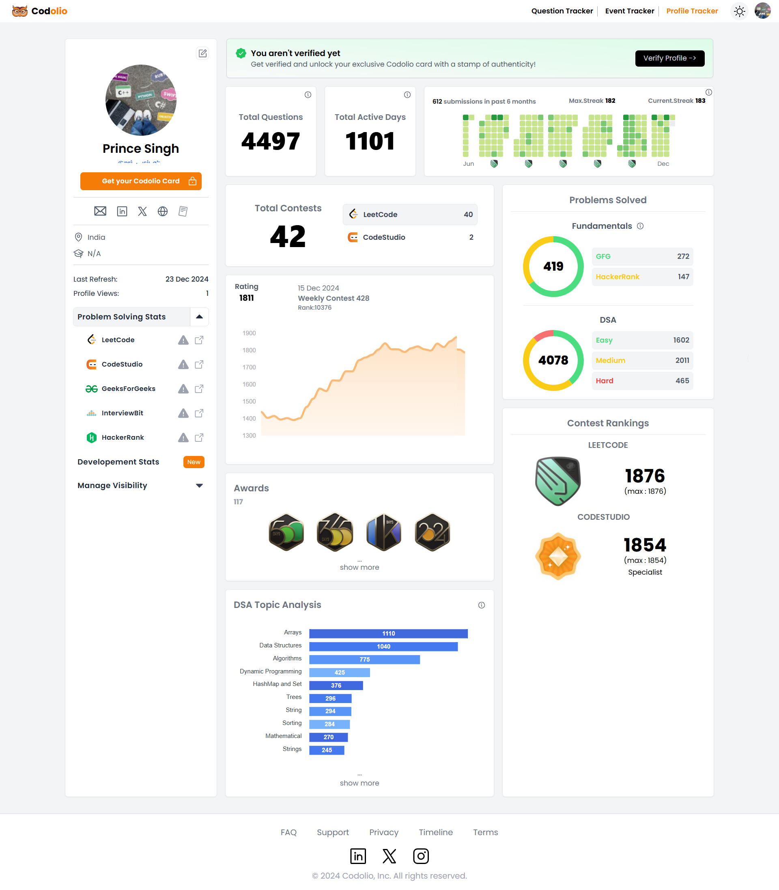

                     

<h1 align="center">Hi  I'm <b>Prince Singh (SDE 1 & Tech Lead)</b></h1>
<!--<h2 align="center"><b>I'm a Remote Developer & Software Engineer</b></h2> -->
<h2 align="center"><b>Cracked National & International 4 Remote Job As A Fresher, ( 4x Remote SDE ) 💯</b></h2> 

<b>SDE 1 @proPeers | Ex-Junior SDE Intern @CloudConduction | Mentor @proPeers & @topmate.io | 3.5⭐ LEETCODE | Max(1876) Rating Knight👑 Top 5% 🌍 | Institute 1🥇 Rank GFG | Global🥇 13th Rank InterviewBit | Max(1854) Rating Specialist🌞 CodeStudio Level 9 🚀 | Building @DSAwithPrinceSingh | Problem Solving Enthusiast 🧠 | 1200DaysOfCode+ on @LeetCode | 1200DaysOfCode Streak 🔥 | 6⭐ Problem Solving | Amateur HackerEarth | 1500+ Problems Solved on DSA | DSA & DEV Mentor | HardCore DSA Enthusiast ❤️ | 75DayHardPlacementChallenge 🔥</b> 
</b>

  
     
 
 
 
  
    
    

<!--  -->
---
## About Me
 <!--  -->

- 🧠 Hardcore DSA Enthusiast & Problem-Solving Addict <b>5000+ problems solved with 1200+ Days of Consistent Code</b> across all major platforms, Passionate About Crafting Efficient Code.
- 👨‍💻 Tech Explorer - Love to learn new technologies and explore new sets of areas.
- ✋ Hand-Holding Expertise: MERN, DevOps, Networking, Servers, System Design, Cost Optimization
- 🎓 Top-Rated Mentor - Mentored 40,000+ students and professionals over the last 1.5 years on DSA, Development, Career Growth & Remote Job Prep and Interview Preparation
- 👁‍🗨 Open Source Contributor
- 👨‍🏫 Mentor on @Topmate and @Propeers
- 📚 Building <b>[**Prepration Street**](https://www.preparationstreet.com/)</b>
 <!--- 📔 Live [**MyResume**](https://princesinghhub.github.io/MYWebResume/)
- 🔥 [**My DSA and Development Skills**](https://linktr.ee/itsPrinceSingh) --->
- 📞 Book Your 1:1 Guidacne **DSA & Development & Placement & Career Guidance** [**Topmate**](https://topmate.io/itsprincesingh) and [**ProPeers**](https://www.propeers.in/profile/princesingh)
- ⚡ For Fun **Games, Rosting, Mems, HipHop**
---
## 👨‍🏫 Professional Experience (From Jan 2024 - Present)

### **ProPeers**

#### **Founding Engineer (July 2025 – Present)**

* 🌟 **Led AI innovation with the launch of Roadmap AI**, a personalized AI roadmap assistant powered by **RAG (Retrieval-Augmented Generation)**, **OpenAI text-embedding-ada-002**, and **Modal** for scalable inference.

  * Integrated **MCP (Modular Content Pipeline)** to contextually index 100+ roadmaps and learning paths.
  * Supported **fine-grained AI subscriptions** (one-time, monthly, yearly), and managed **token usage, speed optimization, and upgrade flows**.
  * Resulted in **instant intelligent roadmap recommendations**, reducing user decision fatigue and increasing retention.

* ⚡ Achieved **sub-1s AI response times**, enabling smooth in-app AI chat and query resolution across large-scale learning data.

* 👥 Addressed scaling issues for AI usage among **power users and high-frequency learners**, ensuring consistent performance and cost-effectiveness.

* 🔍 Extended "AskAI" to leverage **contextual roadmap nodes + discussion data**, improving solution relevance and real-time suggestions.

* 💡 Drove AI product strategy in alignment with user needs and industry demands — transforming the platform into an **AI-first learning ecosystem**.

---

**July 2024 – July 2025**  
SDE - 1 · Delhi, India · Remote 
* 🚀 **Built and scaled the flagship "Roadmaps" feature**, delivering **100+ curated learning paths** across DSA, Development, and System Design — **used by 100K+ users**. Improved personalization and relevance, while reducing API response time from **2.1s to < 300ms**, resulting in a **7x faster experience** and **40% higher user engagement**.

* 🤖 **Developed and integrated the "AskAI + Discussion Forum"**, an intelligent peer-programming assistant where users can **interact with AI** to solve DSA/Dev doubts and collaborate with others — enabling **on-demand doubt resolution** and **community learning**.

* 📹 **Engineered a Session Recording Bot** using **Python, Selenium**, and **headless Azure VMs** with deep link automation — automating session joining and recording, cutting down **100% of manual effort** and improving reliability.

* ⚙️ **Optimized 150+ APIs** by implementing **advanced caching layers, async processing, and API pipelines**, reducing backend latency by **up to 70%** and improving system throughput.

* 🎯 **Reduced core web vitals**  **TBT, LCP, and FCP from 4.4s to 990ms** through advanced frontend optimizations (SSR, dynamic imports, lazy-loading APIs), significantly boosting **UX for 15K+ monthly active users**.

* 🧠 **Led the end-to-end performance overhaul** of the platform, focusing on smoother tab-switching experiences, minimal downtime, and blazing-fast navigation across the app.

* 🗃️ **Migrated MongoDB from Atlas to self-hosted replica sets**, wrote automated **backup & recovery scripts**, set up VMs, and integrated **cron-based backups to Azure Blob**, ensuring **data durability and cost-efficiency**.

* 📊 Set up **real-time monitoring and alerting** with **Prometheus and Grafana**, ensuring **system health**, proactive issue resolution, and enhanced DevOps visibility.

* 🚢 **Deployed scalable CI/CD pipelines** using **Azure, GitLab, and Vercel**, ensuring **zero-downtime deployments** and faster iteration cycles across teams.

* 🔧 **Handled end-to-end production deployment** and scaling for a system serving **15K+ users**, maintaining **high availability, fault tolerance**, and robust performance at scale.

---

### Cloud Conduction  
**Jan 2024 – June 2024**  
Junior Software Engineer · Oak Park, Michigan, United States · Remote 
* 💬 **Built an AI-powered chat application** from the ground up using **React and .NET**, improving **frontend efficiency by 60%** and backend performance by **30%**, delivering a highly responsive user experience.

* ⚡ **Integrated and optimized AI model responses**, reducing latency from **1.86s to 1.2s (35% faster)** through strategic API design, caching, and performance tuning.

* ☁️ **Designed scalable cloud architecture on Microsoft Azure** for AI workloads, improving system **throughput by 10%** while significantly **reducing infrastructure costs** via autoscaling and resource optimization.

* 🎨 **Developed modern, responsive UI components** in React that improved **user engagement metrics by 25%**, including better retention and interaction rates.

* 🔐 **Implemented secure, scalable API gateways in .NET Core**, capable of handling **500+ concurrent requests** with **99.9% uptime**, supporting production-level reliability.

* 🚀 **Led the implementation of new features** using the **MERN stack**, cutting down **development time by 40%**, and accelerating product iteration cycles.

* 🛠️ **Established CI/CD pipelines** (Azure DevOps & GitHub Actions), reducing **deployment failures by 75%** and enabling **faster, automated releases**.

* 🧹 **Conducted in-depth code reviews and optimization**, reducing **technical debt by 30%**, standardizing best practices across teams, and improving maintainability.

* 🔄 **Owned and managed the complete project lifecycle**, from initial system design and dev planning to **production deployment**, server setup, and post-launch support.

---

## ❤️ I'm Code on (DSA)

 

 

 

---
## All DSA Badges @LeetCode

</img>
</img>
</img>
</img>
</img>
</img>
</img>
</img>
</img>
</img>
</img>
</img>
</img>
</img>
</img>
</img>
</img>
</img>
</img>
</img>
</img>
</img>
</img>
</img>
</img>
</img>
</img>
</img>
</img>
</img>
</img>
</img>
</img>
</img>
</img>
</img>
</img>
</img>
</img>
</img>
</img>
</img>
</img>
</img>
</img>
</img>
</img>
</img>
</img>
</img>
</img>
</img>
</img>
</img>
</img>
</img>
</img>
</img>

---
## ⭐ Key Highlights 🎉

| 🎯 My Prepration Challenge's 🎯 | 🥇 Other Achievement 🥇 |
|------------------------------------|----------------------------------------|
| 💥 75DaysHardPlacementChallenge  | ⭐ 40000+ Students Guide for Placements and DSA and CP and Development | 
| 💥 1200DaysOfCode+ on @LeetCode  | ⭐ Top performer in College " Rank 1 " [Acadiemic & Coding ] |
| 💥 365DaysOfCode+ on @InterviewBit |  ⭐ DSA & DEV Highe Rated Mentor on @TopMate ( Included in Top 1% ) |
| 💥 700DaysOfCode+ on @CodeStudio | ⭐ 100K+ Total Followers on LinkedIn, X, Instagram, Youtube, Github, Community |
| 💥 1000DaysOfCode+ on @GeeksForGeeks | ⭐ 10M+ Views on LinkedIn |

---
## 🏆 DSA Battleground

🚀 Excited to Share My Coding Journey and Accomplishments! 🚀

🚀 I'm thrilled to showcase my **dedication and passion for problem-solving** in the world of coding, over the past few years, 
I’ve **solved 5000+ DSA problems across 10+ top coding platforms** with an **unbreakable 1200+ day streak** of daily practice.
This journey reflects my relentless focus on **logic, consistency, and mastery of core CS fundamentals**.

**LeetCode and GeeksForGeeks 🏆**
- Profile 1: 1200+ problems solved, 3.5⭐ with a max rating of 1660 and 50+ Badges 🥇.
- Annual Awards 2022 and 2023 on LeetCode and Include Top 0.4% of the LeetCoders 🌐.
- Profile 2: 800+ problems solved, 2⭐ with a max rating of 1876 and 10+Badges 🥇 with Knight 👑 Tag and Include in Top 5% Code in the World 🌎.
- Annual Award 2023 and Include Top 4.2% of the LeetCoders 🌐.
- GeeksForGeeks: 1300+ problems solved, Global Rank 100 and Monthly Rank 99 with the Score of 4000+, and Instutie Rank 1🔥.

**CodeStudio & InterviewBit & HackerRank & HackerEarth 🏆**
- CodeStudio: 2000+ problems solved with 100000+ Coding Score, including in the top 0.5% 🌟.
- InterviewBit: 560+ problems solved, Global Rank 13, and a 6⭐ in Problem Solving 🌐.
- HackerRank: 300+ problems solved, with a coding score of 119000+ 🚀.
- HackerEarth: 5⭐ in Python, 5⭐ in Java, and 5⭐ in Days of Code 🌈.

**work@Tech 🏆**
- work@Tech: 1510 score, 999 rank, and 40 problems solved, with the best global rank under 1K 🚀.

I'm proud of my continuous growth and learning in the coding world. I am looking forward to more challenges and achievements ahead! 💻🚀

---
## <b> Use To Code</b> 💻

<table align="center">
  <tr>
    <td align="center" width="90"> JavaScript</td>
    <td align="center" width="90"> TypeScript</td>
    <td align="center" width="90"> React</td>
    <td align="center" width="90"> Next.js</td>
    <td align="center" width="90"> Node.js</td>
    <td align="center" width="90"> Express.js</td>
    <td align="center" width="90"> MongoDB</td>
    <td align="center" width="90"> MySQL</td>
    <td align="center" width="90"> HTML</td>
    <td align="center" width="90"> CSS</td>
  </tr>
  <tr>
    <td align="center" width="90"> Tailwind CSS</td>
    <td align="center" width="90"> Bootstrap</td>
    <td align="center" width="90"> Redux</td>
    <td align="center" width="90"> Python</td>
    <td align="center" width="90"> Redis</td>
    <td align="center" width="90"> C++</td>
    <td align="center" width="90"> Java</td>
    <td align="center" width="90"> C</td>
    <td align="center" width="90"> C#</td>
    <td align="center" width="90"> .NET</td>
  </tr>
  <tr>
    <td align="center" width="90"> Azure</td>
    <td align="center" width="90"> Git</td>
    <td align="center" width="90"> GitHub</td>
    <td align="center" width="90"> VS Code</td>
    <td align="center" width="90"> Figma</td>
    <td align="center" width="90"> Jenkins</td>
    <td align="center" width="90"> GitHub Actions</td>
    <td align="center" width="90"> Docker</td>
    <td align="center" width="90"> Kubernetes</td>
    <td align="center" width="90"> Terraform</td>
  </tr>
   <tr>
    <td align="center" width="90"> Linux</td>
    <td align="center" width="90"> Scikit-Learn</td>
    <td align="center" width="90"> Scrapy</td>
    <td align="center" width="90"> React Query</td>
    <td align="center" width="90"> OpenAI</td>
    <td align="center" width="90"> PyCharm</td>
    <td align="center" width="90"> IntelliJ IDEA</td>
    <td align="center" width="90"> GitLab Actions</td>
    <td align="center" width="90"> GitHub Copilot</td>
    <td align="center" width="90"> Selenium</td>
   
</tr>
      <tr>
           <td align="center" width="90"> Grafana</td>
    <td align="center" width="90"> Prometheus</td>
            </tr>
</table>

---
## 📝 PROJECT's ZONE (Working on 30+ Persional Projects)

| Project Row I                        | Project Row II      |
|------------------------------------|----------------------------------------|
| 🌐  MyCodingProfiles [**🔗**](https://github.com/PrinceSinghhub/MyCodingProfiles) | 🌐 Shorting Algorithm Website [**🔗**](https://sortingalgorithmswebsite.netlify.app/) | 
| 🌐  MYWebResume [**🔗**](https://github.com/PrinceSinghhub/MYWebResume) | 🌐 Animated My DSA Profiles Circle [**🔗**](https://mydsacircle.netlify.app/) | 
| 🌐 ADVANCED-BINARY-CALCULATOR [**🔗**](https://github.com/PrinceSinghhub/ADVANCED-BINARY-CALCULATOR) | 🌐 ChessBoard [**🔗**](https://mychessbord.netlify.app/) | 
| 🌐 MY-AI-ASSISTANT [**🔗**](https://github.com/PrinceSinghhub/MY-AI-ASSISTANT) | 🌐 My Resume Clone [**🔗**](https://princesinghresume.netlify.app/) | 
| 🌐 Sorting-Algorithms-With-GUI [**🔗**](https://github.com/PrinceSinghhub/Sorting-Algorithms-With-GUI) | 🌐 MyCertificatesGallary [**🔗**](https://mycertificatesgallary.netlify.app/) | 
| 🌐 Get-System-Information [**🔗**](https://github.com/PrinceSinghhub/Get-System-Information) | 🌐 My DSA Journey WebSite  [**🔗**](https://dsajourneyofprincesingh.netlify.app/) |
| 🌐 Increment Decrement Calculator [**🔗**](https://incrementdecrementoperator.netlify.app/) | 🌐 Share Modal [**🔗**](https://dsamodal.netlify.app/) | 
| 🌐 ToDo-List-GUI-Python [**🔗**](https://github.com/PrinceSinghhub/ToDo-List-GUI-Python) | 🌐 Tick-Tak-Too Game [**🔗**](https://github.com/PrinceSinghhub/Tick-Tak-Too-Game) | 
| 🌐 Portfolio [**🔗**](https://portfolioofprince.netlify.app/) | 🌐 Modern DSA Profile Sharing [**🔗**](https://moderndsaprofilesharingpage.netlify.app/) |
| 🌐 Tick-Tack-Too Game using Dev [**🔗**](https://ticktacktoogame.netlify.app/) | 🌐 RazorpayClone WebSite [**🔗**](https://github.com/PrinceSinghhub/RazorpayClone-WebSite) | 
| 🌐 Discord Clone [**🔗**](https://github.com/PrinceSinghhub/Discord-Clone) | 🌐 DSAwithPrinceSingh [**🔗**](https://princesinghhub.github.io/DSAwithPrinceSingh/) | 
| 🌐 GitHub Profile Finder [**🔗**](https://check-your-github.netlify.app/) | 🌐 Check Weather App [**🔗**](https://check-today-weather.netlify.app/) | 
| 🌐 CORESubjectsWithME [**🔗**](https://princesinghhub.github.io/CoreSubjectsWithMe/) | 🌐 CPU SCHEDULING ALGORITHM VISUALISER [**🔗**](https://github.com/PrinceSinghhub/CPU-SCHEDULING-ALGORITHM-VISUALISER) | 
| 🌐 MeraCodeEditor [**🔗**](https://github.com/PrinceSinghhub/MeraCodeEditor) | 🌐 Cardiac Care With Virtual Cardiologist (CCVC) [**🔗**](https://github.com/PrinceSinghhub/Cardiac-Care-With-Virtual-Cardiologist-CCVC) |  
| 🌐 75DaysHardPlacementChallenge [**🔗**](https://princesinghhub.github.io/75DaysHardPlacementChallenge/) | 🌐 CloudConduction Payroll 💰 [**🔗**](https://github.com/PrinceSinghhub/CloudConduction-Payroll)

---

    

## 📊 My Github Stats

    

  
   
  <b>Note:</b> Top languages is only a metric of the languages my public code consists of and doesn't reflect experience or skill level.

 
## 📈 Graph

   

## ⌛ GitHub Trophies

---

    
      
    
  

    
      

---

## 📧 Connect with me:

## ❤ Views and Followers

