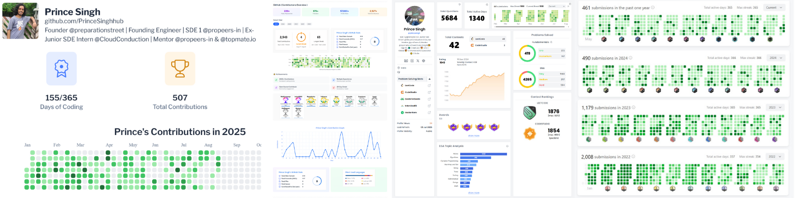
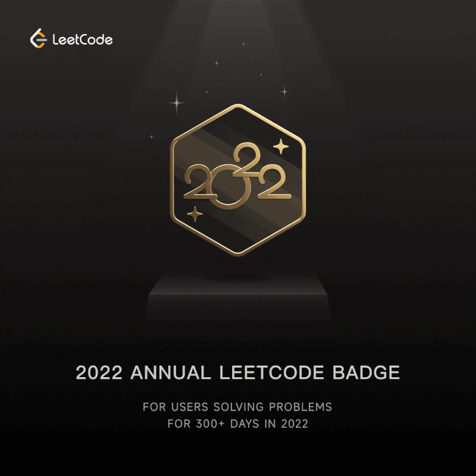
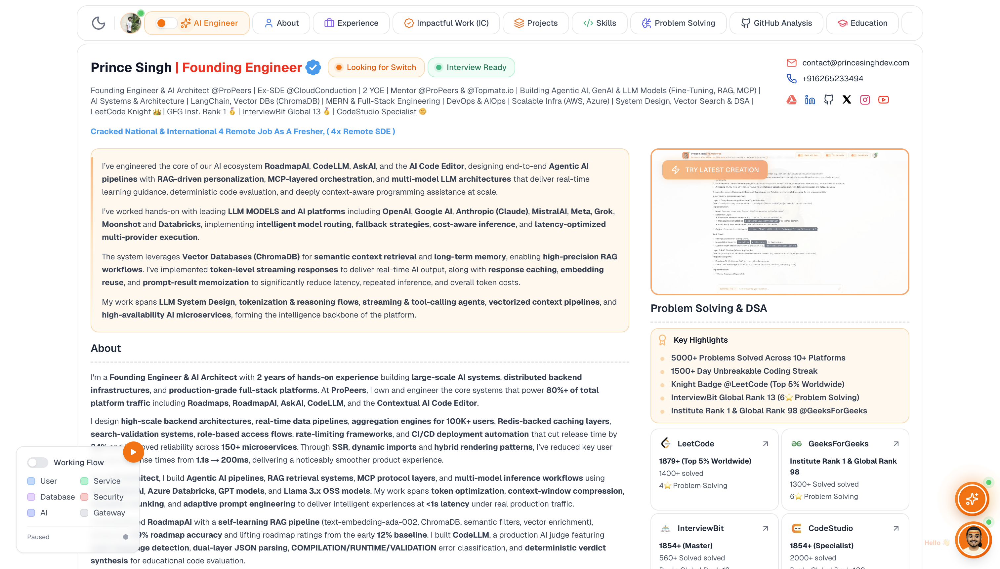
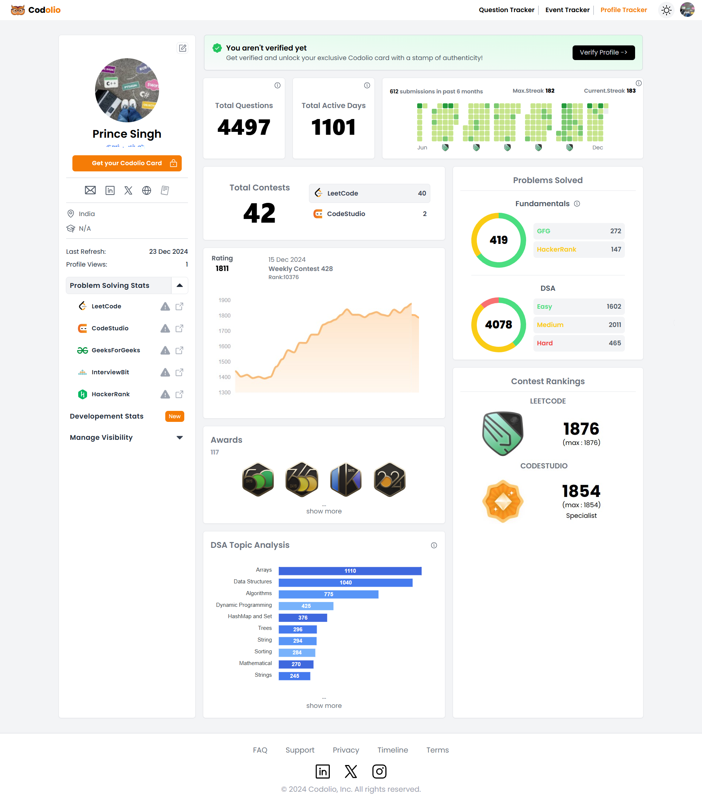

                     

<h1 align="center">Hi  I'm <b>Prince Singh   (Founding Engineer & AI Architect & Tech Lead)</b></h1>
<!--<h2 align="center"><b>I'm a Remote Developer & Software Engineer</b></h2> -->
<h2 align="center"><b>Cracked National & International 4 Remote Job As A Fresher, ( 4x Remote SDE )</b></h2> 

<b>Founding Engineer & AI Architect</b> @ProPeers | Ex-SDE <b>@CloudConduction</b> | Mentor <b>@ProPeers</b> & <b>@Topmate.io</b> | Agentic AI, GenAI, LLMs, RAG, MCP Systems | LangChain, ChromaDB | DevOps, AIOps | DSA, System Design | <b>66K+ @LinkedIn</b> | 3.5⭐ LeetCode | Max(1876) Rating <b>Knight (Top 5%)</b> | Institute <b>Rank 1</b> GFG | Global <b>Rank 13</b> InterviewBit | Max(1854) Rating <b>Specialist</b> CodeStudio Level 9 | Building <b>@PreparationStreet</b> | Problem Solving Enthusiast | 1400+ DaysOfCode on <b>@LeetCode</b> | 6⭐ Problem Solving | Amateur <b>@HackerEarth</b> | <b>5000+ Problems Solved</b> on DSA | <b>DSA & DEV Mentor</b> | HardCore <b>DSA Lover</b> | <b>75DaysHardPlacementChallenge</b>

     
 
 
 
  
    
    

---
## About Me
 <!--  -->

- 🔥 **Founding Engineer & AI Architect** - <b>[**Why I Fit in Your Bucket**](https://www.princesinghdev.com/)</b>
- 🧠 Hardcore DSA Enthusiast & Problem-Solving Addict <b>5000+ problems solved with 1400+ Days of Consistent Code</b> across all major platforms, Passionate About Crafting Efficient Code.
- 👨‍💻 Tech Explorer - Love to learn new technologies and explore new sets of areas.
- ✋ Hand-Holding Expertise: MERN, DevOps, Networking, Servers, System Design, Cost Optimization, and <b>AI Architectures (RAG + MCP + LLM Ops)</b>.
- 🎓 Top-Rated Mentor - Mentored 40,000+ students and professionals over the last 1.5 years on DSA, Development, Career Growth & Remote Job Prep and Interview Preparation.
- 👁‍🗨 Open Source Contributor
- 👨‍🏫 Mentor on @Topmate and @Propeers
- 📚 Building <b>[**Prepration Street**](https://www.preparationstreet.com/)</b>
 <!--- 📔 Live [**MyResume**](https://princesinghhub.github.io/MYWebResume/)
- 🔥 [**My DSA and Development Skills**](https://linktr.ee/itsPrinceSingh) --->
- 📞 Book Your 1:1 Guidacne **DSA & Development & Placement & Career Guidance** [**Topmate**](https://topmate.io/itsprincesingh) and [**ProPeers**](https://www.propeers.in/profile/princesingh)
- ⚡ For Fun **Games, Rosting, Mems, HipHop**

---

## 🎥 Recent Videos on YouTube  

  

  

  

  

  

  

---

## 👨‍🏫 Professional Experience (From Jan 2024 - Present)

### **ProPeers**

#### **Founding Engineer (July 2025 – Present)**

* 🌟 **Led the launch of Roadmap AI**, a fully personalized learning assistant powered by **RAG (Retrieval-Augmented Generation)**, **OpenAI’s `text-embedding-ada-002`**, **Chroma Vector DB**, and **Modal** for real-time, scalable inference — achieving **<1s latency** and serving **10K+ daily queries**.

  * Architected a **self-learning adaptive RAG pipeline**:  
    `[JSON → Embedding → Chroma DB → Query Context Retrieval → Prompt Masking → Model → Nested JSON Output]`

    * Built **zero-context fallback logic**, dynamically deciding when to retrieve context or generate from scratch for complete personalization.  
    * Injected prompt templates based on **match confidence**, with automatic re-embedding of new data — making the system truly **self-evolving**.

* 🧠 Integrated and deployed the **Model Context Protocol (MCP)** — a **dynamic orchestration engine** for multi-model routing, confidence-based context injection, and structured prompt masking across models (`gpt-3.5`, `o3-mini`, `o1`).

* 🧩 Extended the **Modular Content Pipeline (MCP)** to process and vectorize **100+ Roadmaps**, powering semantic retrieval and structured AI roadmap generation.

* ⚙️ Built an **AI-powered DSA Code Editor** supporting Run/Submit/Save with contextual LLM assistance, integrated across `gpt-3.5`, `o3-mini`, and `o1` — delivering real-time code insights and learning support.

* 🧮 Designed **token-based access control** with <b>tiered latency modes</b>, <b>real-time usage metering</b>, and <b>premium upsell logic</b> — optimizing engagement and monetization.

* ⚡ Achieved **sub-second inference** performance across all tiers with caching, async processing, and parallel embeddings, boosting user retention and responsiveness.

* 🔍 Enhanced AskAI with **contextual node + discussion integration**, improving query relevance and contextual assistance accuracy by 40%.

* 📈 Drove **3x increase in roadmap completions**, reduced churn, and transitioned the platform into a **self-adaptive AI-first learning ecosystem** with real-time LLM intelligence.

---

**July 2024 – July 2025**  
SDE - 1 · Delhi, India · Remote 
* 🚀 **Built and scaled the flagship "Roadmaps" feature**, delivering **100+ curated learning paths** across DSA, Development, and System Design — **used by 100K+ users**. Improved personalization and relevance, while reducing API response time from **2.1s to < 300ms**, resulting in a **7x faster experience** and **40% higher user engagement**.

* 🤖 **Developed and integrated the "AskAI + Discussion Forum"**, an intelligent peer-programming assistant where users can **interact with AI** to solve DSA/Dev doubts and collaborate with others — enabling **on-demand doubt resolution** and **community learning**.

* Worked on complex APIs to reduce processing time and improved tab switching experience for smoother navigation
  
* 📹 **Engineered a Session Recording Bot** using **Python, Selenium**, and **headless Azure VMs** with deep link automation — automating session joining and recording, cutting down **100% of manual effort** and improving reliability.

* ⚙️ **Optimized 150+ APIs** by implementing **advanced caching layers, async processing, and API pipelines**, reducing backend latency by **up to 70%** and improving system throughput.

* 🎯 **Reduced core web vitals**  **TBT, LCP, and FCP from 4.4s to 990ms** through advanced frontend optimizations (SSR, dynamic imports, lazy-loading APIs), significantly boosting **UX for 15K+ monthly active users**.

* 🧠 **Led the end-to-end performance overhaul** of the platform, focusing on smoother tab-switching experiences, minimal downtime, and blazing-fast navigation across the app.

* 🗃️ **Migrated MongoDB from Atlas to self-hosted replica sets**, wrote automated **backup & recovery scripts**, set up VMs, and integrated **cron-based backups to Azure Blob**, ensuring **data durability and cost-efficiency**.

* 📊 Set up **real-time monitoring and alerting** with **Prometheus and Grafana**, ensuring **system health**, proactive issue resolution, and enhanced DevOps visibility.

* 🚢 **Deployed scalable CI/CD pipelines** using **Azure, GitLab, and Vercel**, ensuring **zero-downtime deployments** and faster iteration cycles across teams.

* 🔧 **Handled end-to-end production deployment** and scaling for a system serving **15K+ users**, maintaining **high availability, fault tolerance**, and robust performance at scale.

* 💡 Worked with cross-functional teams to integrate **AI personalization**, improving engagement metrics and completion rates by 40%.
  
---

### Cloud Conduction  
**Jan 2024 – June 2024**  
Junior Software Engineer · Oak Park, Michigan, United States · Remote 
* 💬 **Built an AI-powered chat application** from the ground up using **React and .NET**, improving **frontend efficiency by 60%** and backend performance by **30%**, delivering a highly responsive user experience.

* ⚡ **Integrated and optimized AI model responses**, reducing latency from **1.86s to 1.2s (35% faster)** through strategic API design, caching, and performance tuning.

* ☁️ **Designed scalable cloud architecture on Microsoft Azure** for AI workloads, improving system **throughput by 10%** while significantly **reducing infrastructure costs** via autoscaling and resource optimization.

* 🎨 **Developed modern, responsive UI components** in React that improved **user engagement metrics by 25%**, including better retention and interaction rates.

* 🔐 **Implemented secure, scalable API gateways in .NET Core**, capable of handling **500+ concurrent requests** with **99.9% uptime**, supporting production-level reliability.

* 🚀 **Led the implementation of new features** using the **MERN stack**, cutting down **development time by 40%**, and accelerating product iteration cycles.

* 🛠️ **Established CI/CD pipelines** (Azure DevOps & GitHub Actions), reducing **deployment failures by 75%** and enabling **faster, automated releases**.

* 🧹 **Conducted in-depth code reviews and optimization**, reducing **technical debt by 30%**, standardizing best practices across teams, and improving maintainability.

* 🔄 **Owned and managed the complete project lifecycle**, from initial system design and dev planning to **production deployment**, server setup, and post-launch support.

---

## ❤️ I'm Code on (DSA)

 

 

 

---
## All DSA Badges @LeetCode

</img>
</img>
</img>
</img>
</img>
</img>
</img>
</img>
</img>
</img>
</img>
</img>
</img>
</img>
</img>
</img>
</img>
</img>
</img>
</img>
</img>
</img>
</img>
</img>
</img>
</img>
</img>
</img>
</img>
</img>
</img>
</img>
</img>
</img>
</img>
</img>
</img>
</img>
</img>
</img>
</img>
</img>
</img>
</img>
</img>
</img>
</img>
</img>
</img>
</img>
</img>
</img>
</img>
</img>
</img>
</img>
</img>
</img>

---
## ⭐ Key Highlights 🎉

| 🎯 My Prepration Challenge's 🎯 | 🥇 Other Achievement 🥇 |
|------------------------------------|----------------------------------------|
| 💥 75DaysHardPlacementChallenge  | ⭐ 40000+ Students Guide for Placements and DSA and CP and Development | 
| 💥 1400DaysOfCode+ on @LeetCode  | ⭐ Top performer in College " Rank 1 " [Acadiemic & Coding ] |
| 💥 365DaysOfCode+ on @InterviewBit |  ⭐ DSA & DEV Highe Rated Mentor on @TopMate ( Included in Top 1% ) |
| 💥 700DaysOfCode+ on @CodeStudio | ⭐ 100K+ Total Followers on LinkedIn, X, Instagram, Youtube, Github, Community |
| 💥 1000DaysOfCode+ on @GeeksForGeeks | ⭐ 10M+ Views on LinkedIn |

---
## 🏆 DSA Battleground

🚀 Excited to Share My Coding Journey and Accomplishments! 🚀

🚀 I'm thrilled to showcase my **dedication and passion for problem-solving** in the world of coding, over the past few years, 
I’ve **solved 5000+ DSA problems across 10+ top coding platforms** with an **unbreakable 1400+ day streak** of daily practice.
This journey reflects my relentless focus on **logic, consistency, and mastery of core CS fundamentals**.

**LeetCode and GeeksForGeeks 🏆**
- Profile 1: 1300+ problems solved, 3.5⭐ with a max rating of 1660 and 50+ Badges 🥇.
- Annual Awards 2022 and 2023 on LeetCode and Include Top 0.4% of the LeetCoders 🌐.
- Profile 2: 800+ problems solved, 2⭐ with a max rating of 1876 and 10+Badges 🥇 with Knight 👑 Tag and Include in Top 5% Code in the World 🌎.
- Annual Award 2023 and Include Top 4.2% of the LeetCoders 🌐.
- GeeksForGeeks: 1300+ problems solved, Global Rank 100 and Monthly Rank 99 with the Score of 4000+, and Instutie Rank 1🔥.

**CodeStudio & InterviewBit & HackerRank & HackerEarth 🏆**
- CodeStudio: 2000+ problems solved with 100000+ Coding Score, including in the top 0.5% 🌟.
- InterviewBit: 560+ problems solved, Global Rank 13, and a 6⭐ in Problem Solving 🌐.
- HackerRank: 300+ problems solved, with a coding score of 119000+ 🚀.
- HackerEarth: 5⭐ in Python, 5⭐ in Java, and 5⭐ in Days of Code 🌈.

**work@Tech 🏆**
- work@Tech: 1510 score, 999 rank, and 40 problems solved, with the best global rank under 1K 🚀.

I'm proud of my continuous growth and learning in the coding world. I am looking forward to more challenges and achievements ahead! 💻🚀

---
## <b> Use To Code</b> 💻

<table align="center">
  <tr>
    <td align="center" width="90"> Python</td>
    <td align="center" width="90"> JavaScript</td>
    <td align="center" width="90"> TypeScript</td>
    <td align="center" width="90"> LangChain</td>
    <td align="center" width="90"> OpenAI API</td>
    <td align="center" width="90"> RAG</td>
    <td align="center" width="90"> PyTorch</td>
    <td align="center" width="90"> ChromaDB</td>
    <td align="center" width="90"> Vector DB</td>
  </tr>
  <tr>
    <td align="center" width="90"> Prompt Eng.</td>
    <td align="center" width="90"> React</td>
    <td align="center" width="90"> Next.js</td>
    <td align="center" width="90"> Node.js</td>
    <td align="center" width="90"> Express.js</td>
    <td align="center" width="90"> FastAPI</td>
    <td align="center" width="90"> Django</td>
    <td align="center" width="90"> .NET</td>
    <td align="center" width="90"> Prisma</td>
  </tr>
  <tr>
    <td align="center" width="90"> Redux</td>
    <td align="center" width="90"> React Query</td>
    <td align="center" width="90"> Tailwind CSS</td>
    <td align="center" width="90"> Bootstrap</td>
    <td align="center" width="90"> HTML</td>
    <td align="center" width="90"> CSS</td>
    <td align="center" width="90"> SSR</td>
    <td align="center" width="90"> Hybrid Rendering</td>
    <td align="center" width="90"> Linux</td>
  </tr>
  <tr>
    <td align="center" width="90"> Bash</td>
    <td align="center" width="90"> C++</td>
    <td align="center" width="90"> Java</td>
    <td align="center" width="90"> MongoDB</td>
    <td align="center" width="90"> MySQL</td>
    <td align="center" width="90"> PostgreSQL</td>
    <td align="center" width="90"> Redis</td>
    <td align="center" width="90"> Firebase</td>
    <td align="center" width="90"> ChromaDB</td>
  </tr>
  <tr>
    <td align="center" width="90"> Vector Search</td>
    <td align="center" width="90"> AIOps</td>
    <td align="center" width="90"> System Design</td>
    <td align="center" width="90"> API Optimization</td>
    <td align="center" width="90"> Docker</td>
    <td align="center" width="90"> Kubernetes</td>
    <td align="center" width="90"> AWS</td>
    <td align="center" width="90"> Azure</td>
    <td align="center" width="90"> Jenkins</td>
  </tr>
  <tr>
    <td align="center" width="90"> GitHub Actions</td>
    <td align="center" width="90"> GitLab Actions</td>
    <td align="center" width="90"> Terraform</td>
    <td align="center" width="90"> Grafana</td>
    <td align="center" width="90"> Prometheus</td>
    <td align="center" width="90"> Git</td>
    <td align="center" width="90"> GitHub</td>
    <td align="center" width="90"> GitHub Copilot</td>
    <td align="center" width="90"> VS Code</td>
  </tr>
  <tr>
    <td align="center" width="90"> PyCharm</td>
    <td align="center" width="90"> IntelliJ IDEA</td>
    <td align="center" width="90"> Figma</td>
    <td align="center" width="90"> Postman</td>
    <td align="center" width="90"> Selenium</td>
    <td align="center" width="90"> Scrapy</td>
  </tr>
</table>

---
# 🚀 Recent Projects

## 1. AI Multi-Model Orchestration & Comparison Platform

**🔗 Live:** [ai.princesinghai.com](http://ai.princesinghai.com/)

- Architected a production-grade AI multi-model orchestration platform with three distinct phases: **Phase 1 (AI Chat)** integrating **20+ latest models** including OpenAI (GPT-5.2, GPT-5.1), Google (Gemini 3, Gemini 3 Pro, Gemini 3.1 Pro, Gemma 3), Anthropic (Claude Opus 4.6, Opus 4.5, Opus 4.1, Sonnet 4.5, Sonnet 4), xAI (Grok 4), Meta (LLaMA 4 Maverick), Mistral (Mistral 3), DeepSeek (DeepSeek 3.2), Qwen (Qwen3), MiniMax (MiniMax M2), Nvidia (Nemotron Nano), and Moonshot (Kimi K2.5, Kimi K2.2), with intelligent model routing, token streaming, and context window optimization achieving **sub-300ms first-token latency**.

- Engineered **Phase 2 (Best vs Best Comparison Mode)** enabling **parallel execution of 2–4 models simultaneously** (with capability to handle up to 8) for the same query, supporting GPT-5.2, Gemini 3 Pro, Gemini 3.1 Pro, Claude Opus 4.6, Grok 4, LLaMA 4 Maverick, Mistral 3, DeepSeek 3.2, and Kimi K2.5 with side-by-side response rendering, latency benchmarking, and quality scoring – allowing users to visually compare outputs and select the best result, processing **10M+ tokens** distributed during testing with efficient resource utilization across parallel executions.

- Built **Phase 3 (Voice-to-Voice Mode)** supporting Claude Opus 4.6 and Kimi K2.2 with real-time speech recognition (Azure Speech), voice activity detection, and streaming text-to-speech with natural prosody, achieving **<300ms end-to-end voice latency** and enabling conversational AI for visually impaired users and hands-free interaction with **7+ language support**.

- Implemented a unified **RAG pipeline** with ChromaDB on Azure VMs (Central India) storing **10M+ embeddings**, providing semantic context retrieval with 0.25 similarity threshold and topic-aware filtering to deliver hallucination-resistant responses across all three phases, achieving **95% reduction in hallucinations**.

- Designed an **MCP-compliant prompt engineering layer** with dynamic system/user role injection, adaptive tone control (professional, casual, friendly, technical), and long-term memory using **Redis** for session persistence, enabling context-aware conversations that remember user preferences and conversation history.

- Created a fine-tuning orchestration engine that allows per-model prompt customization and response formatting (JSON, markdown, plain text), ensuring consistent output structure across different models and enabling **seamless switching between phases with zero configuration changes**.

- Developed a comprehensive security layer with **JWT authentication, Google/GitHub OAuth**, rate limiting (3 requests/minute per user), API key validation, and IP-based blocking to prevent unauthorized access and abuse, processing **50K+ daily API calls** with **zero security breaches** and **99% reduction in API abuse**.

- Built a real-time token streaming architecture using **Server-Sent Events (SSE) and WebSockets**, delivering incremental responses with <50ms chunk intervals, and implemented context streaming for long conversations, **reducing perceived latency by 60%** and improving user engagement.

- Integrated **Azure Communication Services** for real-time chat and video consultations between users and AI mentors, supporting **1000+ concurrent sessions** with <50ms latency, and added Azure Speech Services for voice-to-voice interaction with 7+ language support including English, Hindi, Spanish, French, German, Japanese, and Mandarin.

- Optimized multi-cloud infrastructure using **AWS CloudFront CDN** for static assets, **Azure Load Balancers** for compute, and strategic Redis caching, achieving **sub-100ms API responses for 90% of requests** and **reducing infrastructure costs by 25%** through intelligent auto-scaling and dynamic model routing based on cost/latency optimization.

---

## 2. PrinceSinghAI - Most Advanced AI Portfolio

**🔗 Live:** [www.princesinghai.com](http://www.princesinghai.com/)

- Architected a production-grade AI multi-model orchestration platform with three distinct phases: **Phase 1 (AI Chat)** integrating **20+ latest models** including OpenAI (GPT-5.2, GPT-5.1), Google (Gemini 3, Gemini 3 Pro, Gemini 3.1 Pro, Gemma 3), Anthropic (Claude Opus 4.6, Opus 4.5, Opus 4.1, Sonnet 4.5, Sonnet 4), xAI (Grok 4), Meta (LLaMA 4 Maverick), Mistral (Mistral 3), DeepSeek (DeepSeek 3.2), Qwen (Qwen3), MiniMax (MiniMax M2), Nvidia (Nemotron Nano), and Moonshot (Kimi K2.5, Kimi K2.2), with intelligent model routing, token streaming, and context window optimization achieving **sub-300ms first-token latency**.

- Engineered **Phase 2 (Best vs Best Comparison Mode)** enabling **parallel execution of 2–4 models simultaneously** (with capability to handle up to 8) for the same query, supporting GPT-5.2, Gemini 3 Pro, Gemini 3.1 Pro, Claude Opus 4.6, Grok 4, LLaMA 4 Maverick, Mistral 3, DeepSeek 3.2, and Kimi K2.5 with side-by-side response rendering, latency benchmarking, and quality scoring – allowing users to visually compare outputs and select the best result, processing **10M+ tokens** distributed during testing with efficient resource utilization across parallel executions.

- Built **Phase 3 (Voice-to-Voice Mode)** supporting Claude Opus 4.6 and Kimi K2.2 with real-time speech recognition (Azure Speech), voice activity detection, and streaming text-to-speech with natural prosody, achieving **<300ms end-to-end voice latency** and enabling conversational AI for visually impaired users and hands-free interaction with **7+ language support**.

- Implemented a unified **RAG pipeline** with ChromaDB on Azure VMs (Central India) storing **10M+ embeddings**, providing semantic context retrieval with 0.25 similarity threshold and topic-aware filtering to deliver hallucination-resistant responses across all three phases, achieving **95% reduction in hallucinations**.

- Designed an **MCP-compliant prompt engineering layer** with dynamic system/user role injection, adaptive tone control (professional, casual, friendly, technical), and long-term memory using **Redis** for session persistence, enabling context-aware conversations that remember user preferences and conversation history.

- Created a fine-tuning orchestration engine that allows per-model prompt customization and response formatting (JSON, markdown, plain text), ensuring consistent output structure across different models and enabling **seamless switching between phases with zero configuration changes**.

- Developed a comprehensive security layer with **JWT authentication, Google/GitHub OAuth**, rate limiting (3 requests/minute per user), API key validation, and IP-based blocking to prevent unauthorized access and abuse, processing **50K+ daily API calls** with **zero security breaches** and **99% reduction in API abuse**.

- Built a real-time token streaming architecture using **Server-Sent Events (SSE) and WebSockets**, delivering incremental responses with <50ms chunk intervals, and implemented context streaming for long conversations, **reducing perceived latency by 60%** and improving user engagement.

- Integrated **Azure Communication Services** for real-time chat and video consultations between users and AI mentors, supporting **1000+ concurrent sessions** with <50ms latency, and added Azure Speech Services for voice-to-voice interaction with 7+ language support including English, Hindi, Spanish, French, German, Japanese, and Mandarin.

- Optimized multi-cloud infrastructure using **AWS CloudFront CDN** for static assets, **Azure Load Balancers** for compute, and strategic Redis caching, achieving **sub-100ms API responses for 90% of requests** and **reducing infrastructure costs by 25%** through intelligent auto-scaling and dynamic model routing based on cost/latency optimization.

---

## 3. PrinceSinghDev - Multi-Cloud Full-Stack AI Platform

**🔗 Live:** [www.princesinghdev.com](https://www.princesinghdev.com/)

- Architected a production-grade multi-cloud full-stack platform serving **princesinghdev.com** & **ai.princesinghdev.com** with **12,000+ unique visitors**, processing **18,000+ AI queries** and gathering **500+ user reviews**, leveraging AWS (primary) with EC2, S3, CloudFront, DynamoDB, SES, Bedrock and Azure (secondary) with Virtual Machines, Communication Services, AI Foundry, achieving **99.99% uptime** with **sub-100ms automatic failover**.

- Engineered a scalable **MERN stack** backend with **Node.js/Express.js** handling **10,000+ concurrent connections**, implementing connection pooling, request throttling, and response caching to maintain **sub-200ms API latency** under peak loads.

- Built a **Next.js/React** frontend with server-side rendering (SSR), dynamic imports, and route-based code splitting, achieving **98+ Lighthouse scores** for Performance, SEO, and Accessibility across all pages.

- Designed a hybrid database architecture combining **MongoDB Atlas** for user profiles and session data with **AWS DynamoDB** for high-throughput token management and Redis caching layer **reducing database load by 65%** and achieving **sub-5ms cache hits**.

- Implemented comprehensive user analytics pipeline tracking user behavior, feature usage, and conversion funnels through custom event tracking, **ELK Stack** aggregation, and **Grafana dashboards**, enabling data-driven product decisions that **increased user retention by 40%**.

- Created a multi-provider authentication system with **JWT, Google OAuth, GitHub OAuth** and **AWS Cognito** integration, supporting social logins, email/password, and magic link authentication, achieving **zero authentication failures** with **99.99% login success rate**.

- Developed an **AI-powered feedback aggregation engine** that processes 500+ user reviews using sentiment analysis and topic modeling to automatically categorize feature requests and bug reports, **reducing manual triage time by 80%**.

- Built real-time notification system using **Azure Communication Services** and WebSocket connections, delivering live updates to users about their queries, platform announcements, and personalized recommendations with **<50ms latency**.

- Implemented automated **A/B testing framework** with feature flags and gradual rollouts, enabling zero-downtime experimentation on new features and achieving **25% improvement in user engagement metrics**.

- Designed comprehensive error tracking and recovery system with **Sentry** integration, automatic error grouping, and intelligent alerting that **reduced mean time to resolution (MTTR) from hours to under 15 minutes**.

---
## 📝 College PROJECT's ZONE (Working on 30+ Persional Projects)

| Project Row I                        | Project Row II      |
|------------------------------------|----------------------------------------|
| 🌐  MyCodingProfiles [**🔗**](https://github.com/PrinceSinghhub/MyCodingProfiles) | 🌐 Shorting Algorithm Website [**🔗**](https://sortingalgorithmswebsite.netlify.app/) | 
| 🌐  MYWebResume [**🔗**](https://github.com/PrinceSinghhub/MYWebResume) | 🌐 Animated My DSA Profiles Circle [**🔗**](https://mydsacircle.netlify.app/) | 
| 🌐 ADVANCED-BINARY-CALCULATOR [**🔗**](https://github.com/PrinceSinghhub/ADVANCED-BINARY-CALCULATOR) | 🌐 ChessBoard [**🔗**](https://mychessbord.netlify.app/) | 
| 🌐 MY-AI-ASSISTANT [**🔗**](https://github.com/PrinceSinghhub/MY-AI-ASSISTANT) | 🌐 My Resume Clone [**🔗**](https://princesinghresume.netlify.app/) | 
| 🌐 Sorting-Algorithms-With-GUI [**🔗**](https://github.com/PrinceSinghhub/Sorting-Algorithms-With-GUI) | 🌐 MyCertificatesGallary [**🔗**](https://mycertificatesgallary.netlify.app/) | 
| 🌐 Get-System-Information [**🔗**](https://github.com/PrinceSinghhub/Get-System-Information) | 🌐 My DSA Journey WebSite  [**🔗**](https://dsajourneyofprincesingh.netlify.app/) |
| 🌐 Increment Decrement Calculator [**🔗**](https://incrementdecrementoperator.netlify.app/) | 🌐 Share Modal [**🔗**](https://dsamodal.netlify.app/) | 
| 🌐 ToDo-List-GUI-Python [**🔗**](https://github.com/PrinceSinghhub/ToDo-List-GUI-Python) | 🌐 Tick-Tak-Too Game [**🔗**](https://github.com/PrinceSinghhub/Tick-Tak-Too-Game) | 
| 🌐 Portfolio [**🔗**](https://portfolioofprince.netlify.app/) | 🌐 Modern DSA Profile Sharing [**🔗**](https://moderndsaprofilesharingpage.netlify.app/) |
| 🌐 Tick-Tack-Too Game using Dev [**🔗**](https://ticktacktoogame.netlify.app/) | 🌐 RazorpayClone WebSite [**🔗**](https://github.com/PrinceSinghhub/RazorpayClone-WebSite) | 
| 🌐 Discord Clone [**🔗**](https://github.com/PrinceSinghhub/Discord-Clone) | 🌐 DSAwithPrinceSingh [**🔗**](https://princesinghhub.github.io/DSAwithPrinceSingh/) | 
| 🌐 GitHub Profile Finder [**🔗**](https://check-your-github.netlify.app/) | 🌐 Check Weather App [**🔗**](https://check-today-weather.netlify.app/) | 
| 🌐 CORESubjectsWithME [**🔗**](https://princesinghhub.github.io/CoreSubjectsWithMe/) | 🌐 CPU SCHEDULING ALGORITHM VISUALISER [**🔗**](https://github.com/PrinceSinghhub/CPU-SCHEDULING-ALGORITHM-VISUALISER) | 
| 🌐 MeraCodeEditor [**🔗**](https://github.com/PrinceSinghhub/MeraCodeEditor) | 🌐 Cardiac Care With Virtual Cardiologist (CCVC) [**🔗**](https://github.com/PrinceSinghhub/Cardiac-Care-With-Virtual-Cardiologist-CCVC) |  
| 🌐 75DaysHardPlacementChallenge [**🔗**](https://princesinghhub.github.io/75DaysHardPlacementChallenge/) | 🌐 CloudConduction Payroll 💰 [**🔗**](https://github.com/PrinceSinghhub/CloudConduction-Payroll)

---

    

## 📊 My Github Stats

    

  
   
  <b>Note:</b> Top languages is only a metric of the languages my public code consists of and doesn't reflect experience or skill level.

 
## 📈 Graph

   

## ⌛ GitHub Trophies

---

    
      
    
  

    
      

---

## 📧 Connect with me:

## ❤ Views and Followers

