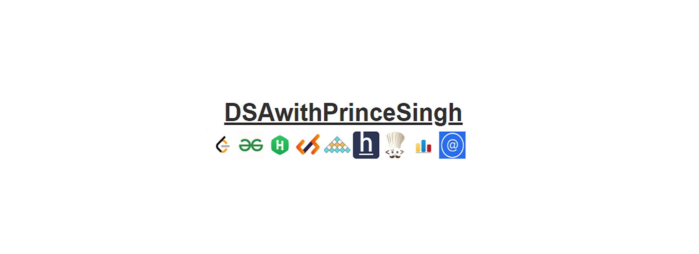

<h1 align="center">Hi  I'm <b>Prince Singh</b></h1>
<h3 align="center"><b>I'm a Passionate for Coding and Developement from India.</b></h3>

<!--  -->

## 🙋‍♂️ About Me

- 📔 Live [**MyResume**](https://princesinghhub.github.io/MYWebResume/) 
- 👨‍💻 Check Me! [**CodingProfile**](https://princesinghhub.github.io/MyCodingProfiles/)
- 🔭 I’m currently Studing in **3rd Year**
- 📘 I’m currently learning **MERN Stack Developement**
- 👯 I’m looking to collaborate on **OpenSource Projects**
- ⚡ For Fun **I play games and interested in Rosting,Mems**
- 📫 How to reach me **thisisprincesingh@gmail.com**

## 🚀 Languages and Tools:

 
    
    
     
     
     
    
    
     
    
    
    
     
    
     
    
      
      
      
     
    
    
    
    

    

## 📊 My Github Stats

    
    
  
   
  <b>Note:</b> Top languages is only a metric of the languages my public code consists of and doesn't reflect experience or skill level.

 
 

 
 

## Connect with me:

## ❤ Views and Followers

